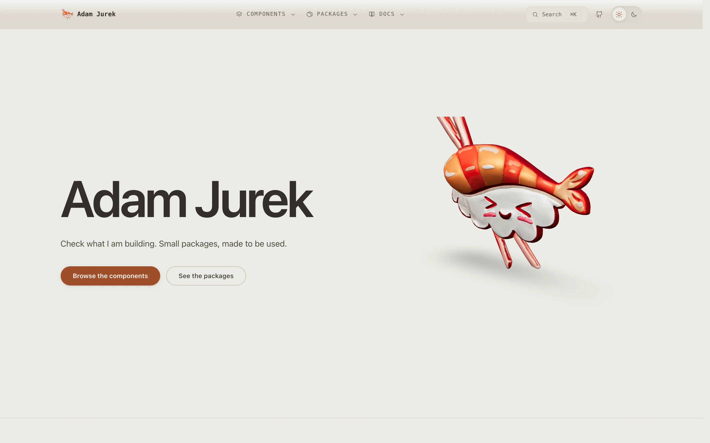
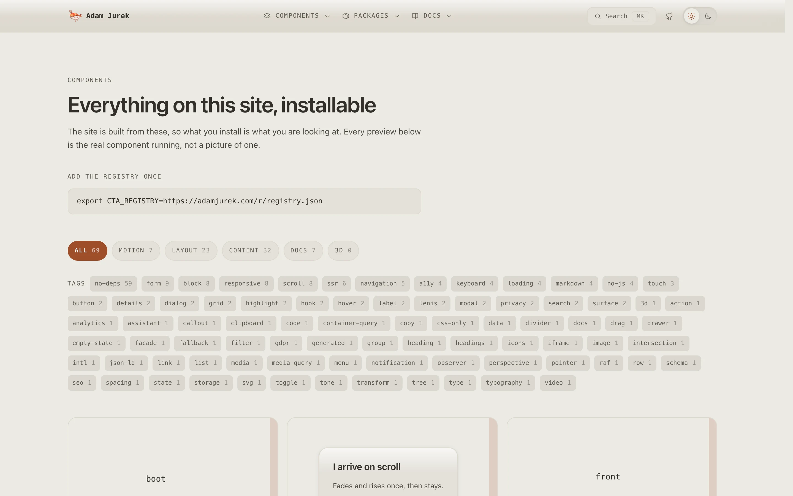

# sushindustries

[](https://buymeacoffee.com/adamjurek)

[](https://skills.sh/sushindustries/sushindustries) · [](https://coderabbit.ai) · [Packages on GitHub](https://github.com/sushindustries?tab=packages)

<table>
<tr>
<td width="50%">

<picture>
	<source media="(prefers-color-scheme: dark)" srcset="media/home-dark.webp" />
	
</picture>

**[adamjurek.com](https://adamjurek.com)** - the site, and the first consumer
of everything below.

</td>
<td width="50%">

<picture>
	<source media="(prefers-color-scheme: dark)" srcset="media/components-dark.webp" />
	
</picture>

**[The components](https://adamjurek.com/components)** - every element,
documented, each printing its own install commands.

</td>
</tr>
</table>

<sub>Both captures are taken by `pnpm media`, never by hand - the doctor
fails when one is missing or older than ninety days, and `--fix` retakes
them.</sub>

My portfolio, and the packages it is built from.

The site is the first consumer of its own component library - every element you
can see on it ships in `@sushindustries/ui`, so anything you like on the page is
something you can install.

```bash
pnpm install
pnpm dev          # http://localhost:3000
```

## Shape

```text
apps/web/                the site. TanStack Start on Vite + Nitro.
packages/atoms/          design tokens + atomic CSS. No build step.
packages/ui/             the components the site is made of. All installable.
packages/adam-jurek/     the umbrella: all of ui + atoms in one dependency.
packages/db/             Drizzle schema + client. Postgres.
```

Every other directory under `packages/` is a package too, and each renders
its own README at `/packages/<name>` on the site.

## Installing the components

Three doors, all served by the site itself:

| Door | Command |
| --- | --- |
| GitHub Packages | `pnpm add @sushindustries/ui @sushindustries/atoms` with `@sushindustries:registry=https://npm.pkg.github.com` in `.npmrc` |
| shadcn | `pnpm dlx shadcn@latest add https://adamjurek.com/r/shadcn/<name>.json` |
| TanStack CLI | `pnpm dlx @tanstack/cli@latest add https://adamjurek.com/r/tanstack/<name>.json` |

The shadcn and TanStack payloads carry the stylesheet with them, so a copied
component arrives styled. Every component page prints its own commands.

## Stack

| | |
| --- | --- |
| [TanStack Start](https://tanstack.com/start) | SSR, server functions, file routes |
| [TanStack Markdown](https://tanstack.com/markdown) | renders each package's README |
| [TanStack Highlight](https://tanstack.com/highlight) | syntax highlighting, synchronous, no client JS |
| [Nitro](https://nitro.build) | builds the Node server that Railway runs |
| [Drizzle](https://orm.drizzle.team) | Postgres schema and queries |
| [Lenis](https://lenis.darkroom.engineering) | smooth scroll |
| [Turborepo](https://turborepo.com) + pnpm | the workspace |

No CSS framework and no component library. `packages/atoms` is ~300 lines of
hand-written CSS, served as-is.

## Using this as a template

It is meant to be reused. The parts worth taking:

- **A component library that cannot rot.** The site imports `packages/ui` the
  same way a stranger would. There is no private path into it, so a component
  that breaks for you broke for me first.
- **Docs that cannot drift.** `/packages/<name>` is generated from that
  package's own `package.json` and `README.md` via `import.meta.glob` at build
  time. Adding a package is creating a directory - there is no index to update
  and nothing to keep in sync.
- **A server boundary you can see.** `packages/db` has two entry points:
  `schema` (types, safe anywhere) and `client.server.ts` (the connection). The
  `.server.ts` suffix is in TanStack Start's default client deny list, so
  importing it from the browser is a build error rather than a review comment.
- **Conventions written down.** `.claude/skills/sushindustries-conventions/`
  holds the layout and naming rules, so an agent working in the repo reads them
  instead of guessing.

To strip it back to a starter: delete `packages/db` if you have no database,
empty `packages/ui/src` down to `Section` and `Card`, and replace
`apps/web/src/modules/chrome/`.

## The skills, on their own

Every skill this repo runs on installs independently of the code -
`npx skills add sushindustries/sushindustries@<name>`:

| Skill | Does |
| --- | --- |
| `sushindustries-conventions` | Layout, naming and boundary rules for a monorepo shaped like this one |
| `add-a-component` | The pipeline for adding a component, its demo, docs and registry entry |
| `document-an-element` | The five-tab documentation contract this site's docs follow |
| `simplify` | Find and remove excess - bloated docs, dead pages, rules nothing checks |
| `going-public` | Flipping a repo from private to public, then publishing its packages |
| `gh-repo-admin` | Safe `gh api` patterns for editing repo settings - branch protection, visibility, Discussions, checking things no REST field exposes |
| `verify-component` | Verify a component actually renders and works, in the running site |
| `toolset` | Check that new content has real content at its live URL, not a source file |
| `hypothesis-testing` | Turn an unverified belief about the site into a checked claim before anyone acts on it |
| `adam-jurek` | Build with this exact design system - components, atoms, voice - in a different project |

## Adding a package

```bash
pnpm new package my-thing
pnpm run doctor --fix
```

The first writes the directory from `templates/`; the second adds the one
line nothing generates (the Dockerfile's manifest COPY). It appears at
`/packages/my-thing` on the next build, README rendered and code
highlighted. Mark it `"private": true` to keep it out.

## Deploy

Railway builds the root `Dockerfile` and runs `node .output/server/index.mjs`.
`/health` is the probe and deliberately checks nothing - a health check that
pings the database turns a slow query into a restart loop.

Environment variables are few, and `scripts/setup-wizard.sh` walks a fresh
machine through every one of them - where each value comes from, and where
it lands. `DATABASE_URL` is the only one the deploy itself requires.

## Checks

```bash
pnpm check    # doctor, lint, types, build - what the pre-push hook runs
pnpm run doctor   # what this repo is missing. --fix repairs what it can
```

## Licence

MIT, and every package in here declares it. `pnpm run doctor` fails a published
workspace that does not, because a package telling people to install it while
granting them no licence is one nobody may legally use.

Two things are not covered by it, and `NOTICE.md` says why: the third-party
logos on the credits page, which are their owners' marks and appear only to
name the projects this site is built on, and the mark in
`apps/web/public/models/` which is the identity of the site rather than
something to reuse. Everything that renders it is MIT and works with any model.

Built by Adam Jurek. One person, which is why everything here is written "I".
