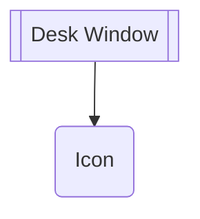

A window you can drag, close and stack. Position is written to the element during a drag and to state only on release.

Installing it installs 1 other element. The diagram is two levels deep, which is where it stops being a map and starts being a hairball - follow a node to see its own.

## Its parts

- `icon` - The glyph set, generated from a Markdown table where every drawing carries its reason. One component, typed names, no icon font.

## What includes it

- `folder-shelf`

## Reading it

A double-bracketed node is a block: an assembly that stands as a region of a
page. A rounded one is a component: one thing with one job. A component
appearing under several parents is the reason this is drawn at all - it is the
fact a list of registry entries cannot show you.

Generated by `pnpm sushindustries graph`. Edit the registry, not this file.
