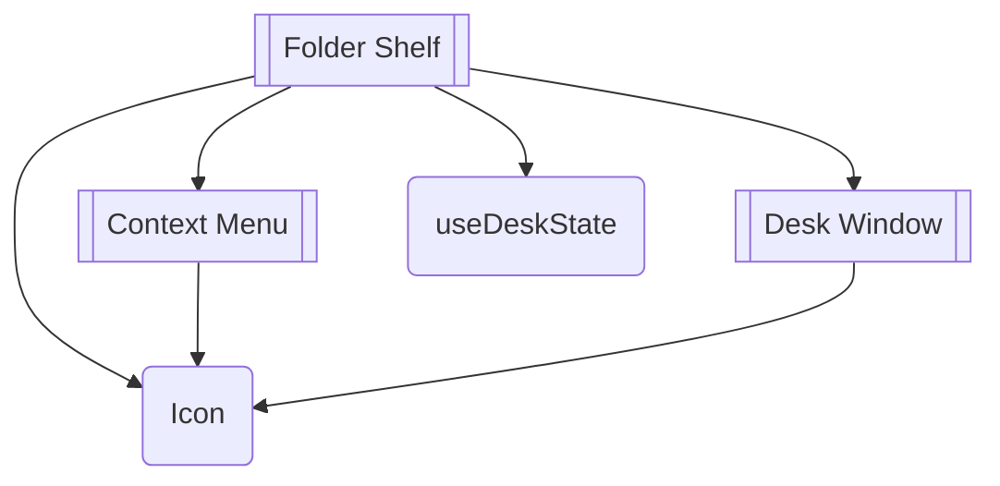

A desktop of folders that open into draggable windows, several at once, remembered between visits.

Installing it installs 4 other elements. The diagram is two levels deep, which is where it stops being a map and starts being a hairball - follow a node to see its own.

## Its parts

- `icon` - The glyph set, generated from a Markdown table where every drawing carries its reason. One component, typed names, no icon font.
- `context-menu` - One menu, reachable by right-click, by long press, and by a button. Escape and arrow keys included.
- `desk-window` - A window you can drag, close and stack. Position is written to the element during a drag and to state only on release.
- `use-desk-state` - Which windows are open, where they sit and what has been put away, remembered without breaking a server render.

## What includes it

Nothing. That is fine for a block, which is a region of a page rather than
a part of one - and worth a second look for a component, because a component
nothing composes and no page shows is a component that was built and
forgotten.

## Reading it

A double-bracketed node is a block: an assembly that stands as a region of a
page. A rounded one is a component: one thing with one job. A component
appearing under several parents is the reason this is drawn at all - it is the
fact a list of registry entries cannot show you.

Generated by `pnpm sushindustries graph`. Edit the registry, not this file.
