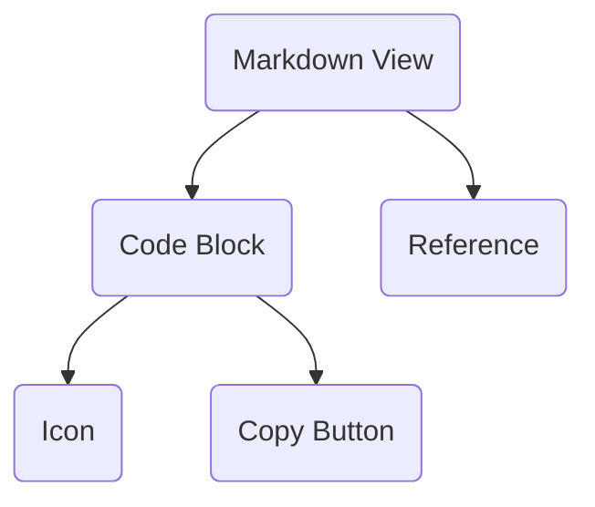

Renders Markdown with callouts, CSS-only tabs, custom blocks and highlighted code.

Installing it installs 2 other elements. The diagram is two levels deep, which is where it stops being a map and starts being a hairball - follow a node to see its own.

## Its parts

- `code-block` - A highlighted code slab with the CLI's colours, a lit top edge, and a copy button that confirms in place.
- `reference` - An inline mention that carries a hover card: title, summary and meta for the thing it names, raised by CSS alone.

## What includes it

Nothing. That is fine for a block, which is a region of a page rather than
a part of one - and worth a second look for a component, because a component
nothing composes and no page shows is a component that was built and
forgotten.

## Reading it

A double-bracketed node is a block: an assembly that stands as a region of a
page. A rounded one is a component: one thing with one job. A component
appearing under several parents is the reason this is drawn at all - it is the
fact a list of registry entries cannot show you.

Generated by `pnpm sushindustries graph`. Edit the registry, not this file.
