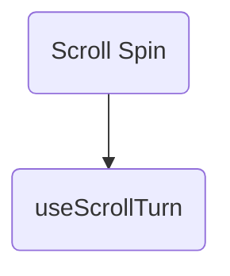

Rotates its children with the page scroll, in a rAF callback rather than React state.

Installing it installs 1 other element. The diagram is two levels deep, which is where it stops being a map and starts being a hairball - follow a node to see its own.

## Its parts

- `use-scroll-turn` - Scroll position as a rotation, delivered once per frame. Drives a CSS transform or a three.js object, never React state.

## What includes it

Nothing. That is fine for a block, which is a region of a page rather than
a part of one - and worth a second look for a component, because a component
nothing composes and no page shows is a component that was built and
forgotten.

## Reading it

A double-bracketed node is a block: an assembly that stands as a region of a
page. A rounded one is a component: one thing with one job. A component
appearing under several parents is the reason this is drawn at all - it is the
fact a list of registry entries cannot show you.

Generated by `pnpm sushindustries graph`. Edit the registry, not this file.
